# Installation steps

In this guideline you will have a full steps instructions on how to install the required tools for our course.

- [Installation steps](#installation-steps)
  - [Android Setup](#android-setup)
    - [Android Studio installation](#android-studio-installation)
    - [Android SDK downloading](#android-sdk-downloading)
    - [Proxy setup](#proxy-setup)
    - [Create a new project](#create-a-new-project)
  - [XAMPP](#xampp)
  - [Vscode Installation](#vscode-installation)
  - [Composer](#composer)
  - [Postman](#postman)
  - [Laravel](#laravel)
    - [Why Laravel?](#why-laravel)
      - [A Progressive Framework](#a-progressive-framework)
      - [A Scalable Framework](#a-scalable-framework)
      - [A Community Framework](#a-community-framework)
    - [How to install laravel?](#how-to-install-laravel)
  - [PhpStorm (optional)](#phpstorm-optional)

## Android Setup

* * *

- Before we start to download and install android studio, we shall first use a vpn in order to access websites which we will use.
  - You can download freegate from [here](https://www.techspot.com/downloads/6243-freegate.html).You will get  a page like this
    \
    &nbsp;
     click on button marked in red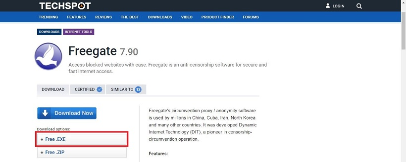.
    \
    &nbsp;
  - Start freegate `you shall see a window like this`
    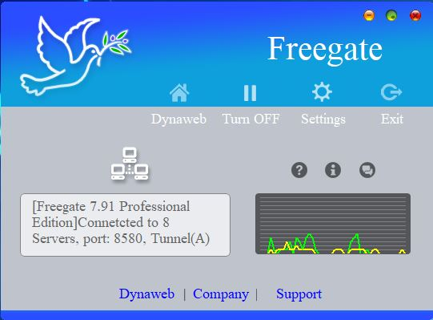

  >**Note** you should chcek that freegate is working in the background _(you will see a graph for network traffic and a simmiler sentence like this `connected to 7 servers`)_

### Android Studio installation

- You can download android studio from [here](https://developer.android.com/studio)

- After you click on the link you will see a page like this._`click on the green button`_

    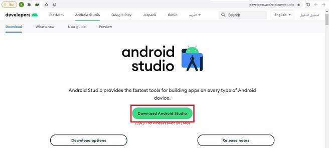
    \
    &nbsp;

- Then Choose `I have read and agree ...` then press on the green button:

    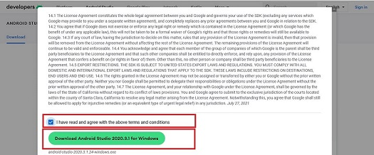
  \
  &nbsp;
- When the download process is finished, run  android studio step. _you should see a window like this_:
  \
  &nbsp;

    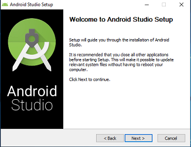
  \
  &nbsp;

- Just click next and folllow these steps:
   \
  &nbsp;

    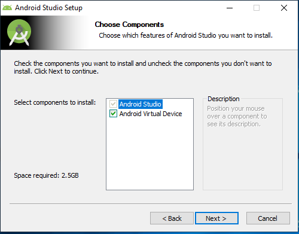
  \
  &nbsp;

    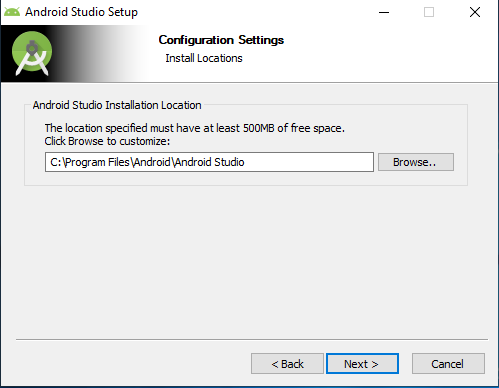
  \
  &nbsp;

    
  \
  &nbsp;

    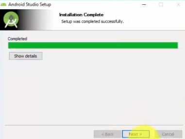
  \
  &nbsp;
- Click finsih.
  \
  &nbsp;
    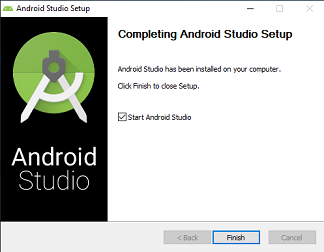
  \
  &nbsp;

- After pressing the finish button, the program will open.
  The following interface may appear. Choose the option "Do not import settings" and press OK.
  \
  &nbsp;
    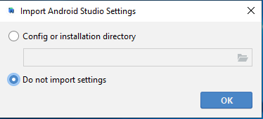
  \
  &nbsp;
- A new window may appear as the following we choose the option _`Don't Send`_
  \
  &nbsp;
    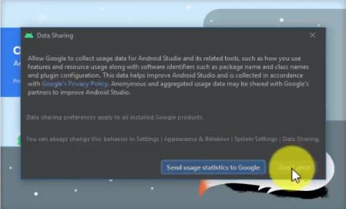
  \
  &nbsp;
- Click next:
  \
  &nbsp;
    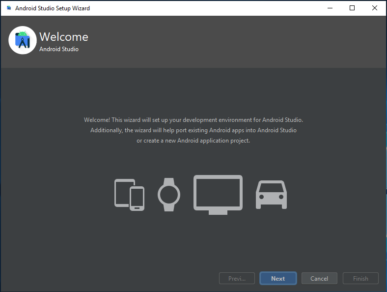
  \
  &nbsp;
- Choose _`Standard`_
  \
  &nbsp;
    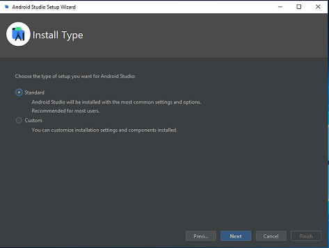
  \
  &nbsp;

- Choose which theme you prefer
  \
  &nbsp;
    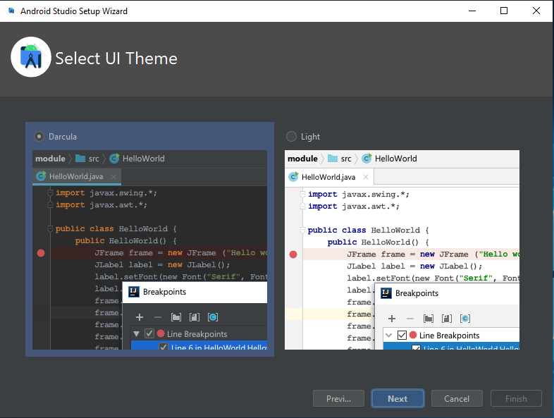
  \
  &nbsp;
- Click `Next`:
  \
  &nbsp;
    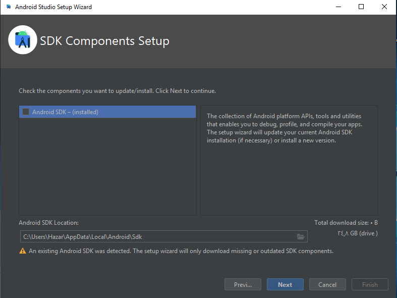
  \
  &nbsp;
- Click `finish`:
  \
  &nbsp;
    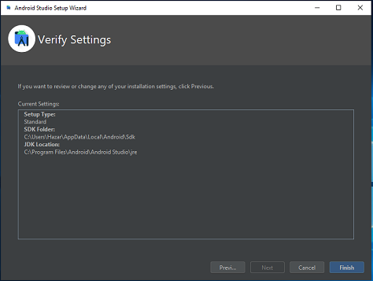
  \
  &nbsp;

- The start window of the program will appear:
  \
  &nbsp;
    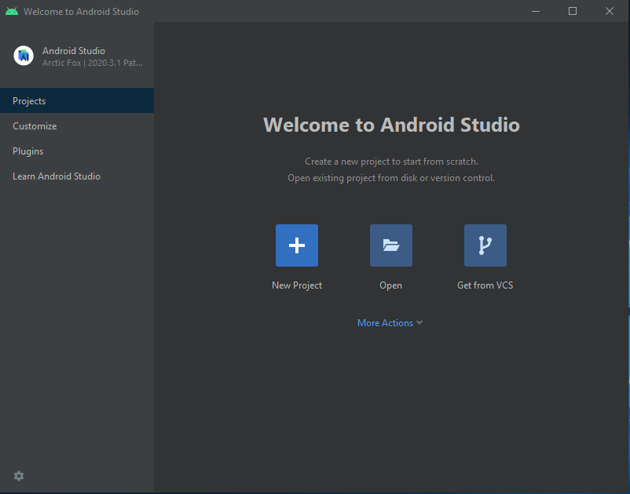
  \
  &nbsp;

### Android SDK downloading

- Download `Android sdk` from [here](https://drive.google.com/file/d/14HiiqvjI_BJek-sZYcuD9M5MIdTB7uGF/view?usp=sharing).

- Create a new folder at `C:\` named `Android`.
- copy the downloaded rar file into `C:\Android`.
- Extract `sdk.rar` there:
  \
  &nbsp;
    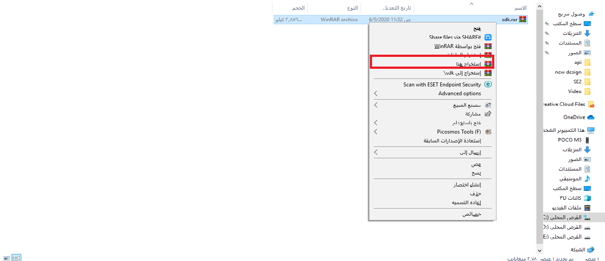
  \
  &nbsp;

- Go back to android studio and click on the `New project` button, a window will appear, from which we choose `open sdk manager` and a similar window will appear
  for the next window (Your window will not contain all the elements here).Just click edit
  \
  &nbsp;
    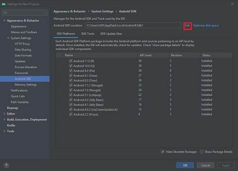
  \
  &nbsp;
  - Click on the button marked in red
  \
  &nbsp;
    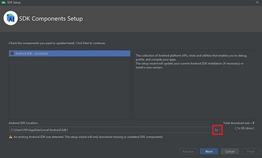
  \
  &nbsp;

- A new window appears for us to choose a new path. We choose the path in which we put the sdk file, which is
  `C:\Android` as in the following image and press OK, after that click next
  \
  &nbsp;
    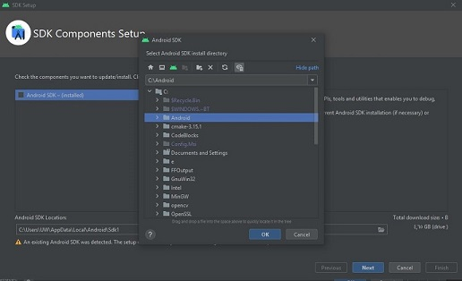
  \
  &nbsp;

- Click `finish`
  \
  &nbsp;
    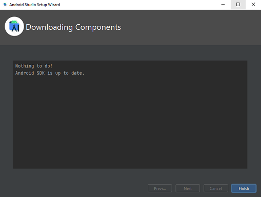
  \
  &nbsp;

- The manager sdk window will appear again and there should be and item appears within the specified area in red here (it is not necessary to have all the items you have as in the picture).
  \
  &nbsp;
    
  \
  &nbsp;

### Proxy setup

- Now, within the previous window, we click on the option Http proxy marked in red.
  \
  &nbsp;
    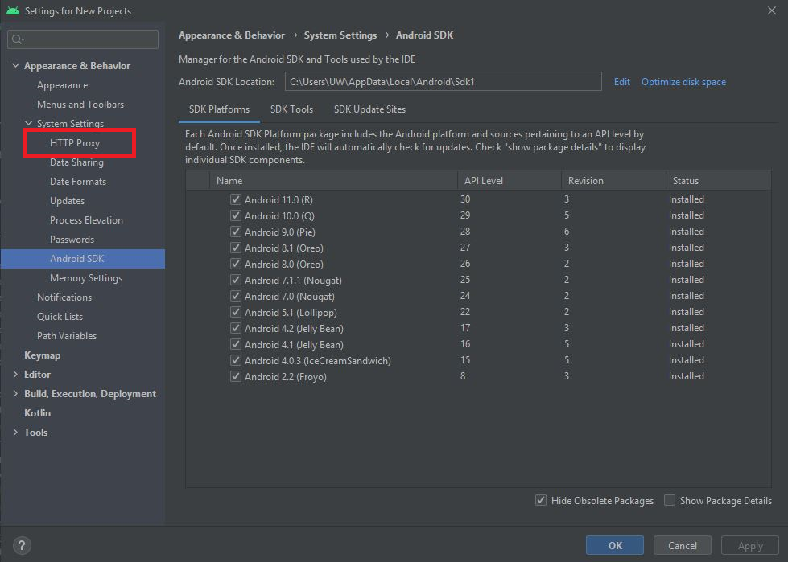
  \
  &nbsp;

  - We make the specified changes marked in red, and then click OK
  \
  &nbsp;
    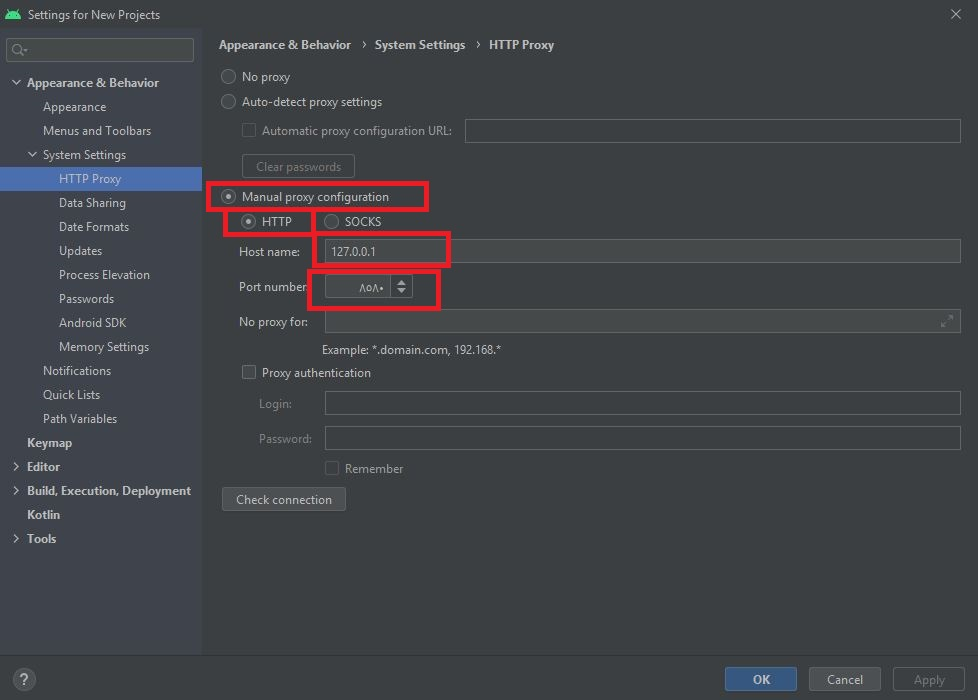
  \
  &nbsp;

### Create a new project

- The start window of the program will appear agin so click on `New project`:
  \
  &nbsp;
    
  \
  &nbsp;

- Choose `Empty Activity` and click next:
  \
  &nbsp;
    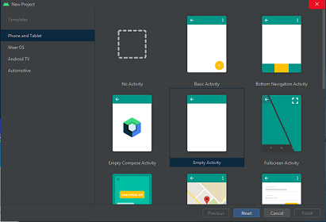
  \
  &nbsp;

- The following window will appear **_`(we choose java in the language field)`_**.
In `Save Location` feild contains the path where Android Studio projects will be saved (it may vary from device to device and can be changed to your desired path)
  \
  &nbsp;
    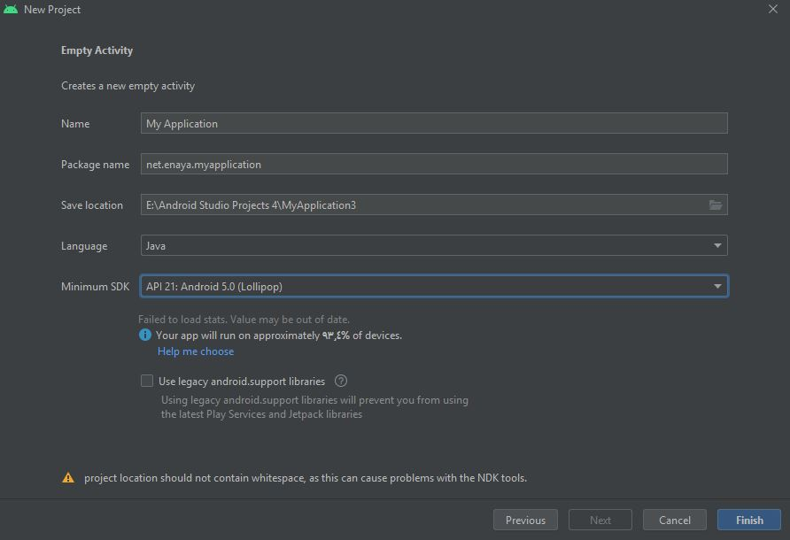
  \
  &nbsp;

- **Before clicking on the finish button, you must make sure that the freegate program is running**.
- Incase that it does not work, **close the program**, check your internet connection, and then run the freegate again. - Now, we click on the `finish` button, and the program will start downloading the necessary packages.
- Incase of  an error occurs during the download process due to poor internet connection or the freegate program has stopped, we press the `synchronization button` shown in red to resume the download.)
  \
  &nbsp;
    
  \
  &nbsp;

## XAMPP

* * *
 XAMPP is a completely free, easy to install Apache distribution containing MariaDB, PHP, and Perl. The XAMPP open source package has been set up to be incredibly easy to install and use.
 Follow these instructions in order to install XAMPP
  
  1. **Download**:
  download and install it from [here](https://www.apachefriends.org/xampp-files/7.4.24/xampp-windows-x64-7.4.24-2-VC15-installer.exe)
      \
      &nbsp;
  2. **Run .exe file**:
  Once the software bundle has been downloaded, you can start the installation by double-clicking on the file with the endin.exe
    \
    &nbsp;
  3. **Start the setup wizard**:
     \
      &nbsp;
      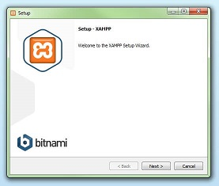
      \
      &nbsp;
  4. **Choose software components**:
      \
      &nbsp;
     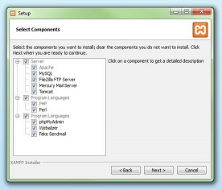
     \
      &nbsp;
  5. **Choose the installation directory**:
     \
      &nbsp;
     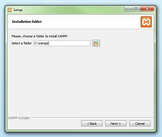
     \
      &nbsp;
  6. **Start the installation process**:
      \
      &nbsp;
     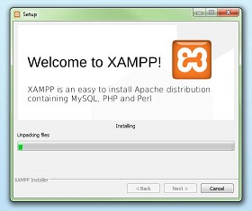
     \
      &nbsp;
  7. **Complete installation**:
     \
      &nbsp;
     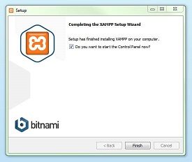

## Vscode Installation

* * *
  Visual Studio Code is a lightweight but powerful source code editor which runs on your desktop and is available for Windows, macOS, and Linux. It comes with built-in support for JavaScript, TypeScript, and Node.js and has a rich ecosystem of extensions for other languages (such as C++, C#, Java, Python, PHP, Go) and runtimes (such as .NET and Unity).
  
  1. **Download**:
      You can download and install it from [here](https://code.visualstudio.com/Download) and choose a version that satisfies your pc/ laptop hardware.
      \
      &nbsp;
      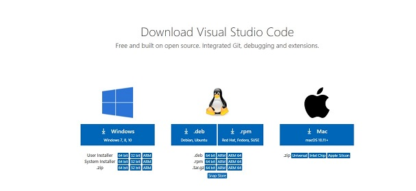.
      \
      &nbsp;

  2. **Run .exe file**:
      Once the software bundle has been downloaded, you can start the installation by double-clicking on the file with the ending .exe Now a dialogue box appears.
      Select I accept the agreement, Then select Next.
      \
      &nbsp;
      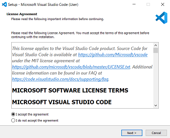
      \
      &nbsp;
  3. **Hit next**:
      \
      &nbsp;
      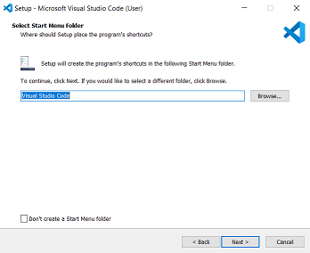
      \
      &nbsp;
  4. **Select the required options** **_`select all options`_**.
      \
      &nbsp;
      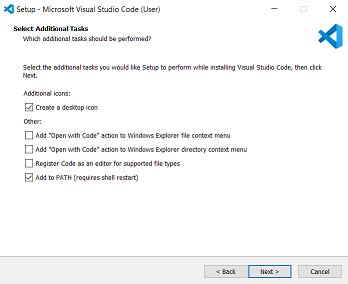
      \
      &nbsp;
  5. **Hit Install**:
      \
      &nbsp;
      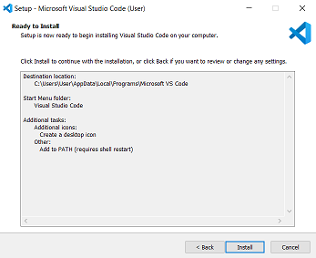
      \
      &nbsp;
  6. **Start the installation process**:
      Wait a bit while it gets installed (The green color fills the bar).
      \
      &nbsp;
      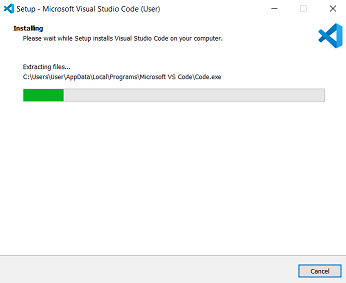
      \
      &nbsp;
  7. **Complete installation**:
     Click `Finish` to exit Setup. Uncheck in the check box.
     \
      &nbsp;
     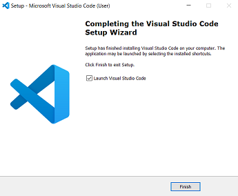
     \
      &nbsp;
  
## Composer

* * *
   Composer is a tool for dependency management in PHP. It allows you to declare the libraries your project depends on and it will manage (install/update) them for you.
   Composer is not a package manager in the same sense as Yum or Apt are. Yes, it deals with "packages" or libraries, but it manages them on a per-project basis, installing them in a directory (e.g. vendor) inside your project. By default, it does not install anything globally. Thus, it is a dependency manager. It does however support a "global" project for convenience via the global command.

- **Download and run** [Composer-Setup.exe](https://getcomposer.org/Composer-Setup.exe)-it will install the latest composer version whenever it is executed. just hit next.
\
&nbsp;
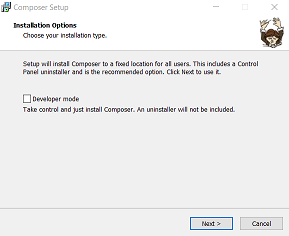.
\
&nbsp;
- Now, **choose the command-line `PHP` path** you want to use, checkmark the box to add the PHP path, and click Next.
\
&nbsp;
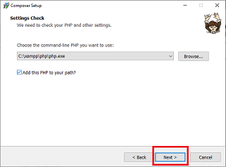
\
&nbsp;
- Composer setup pop-up a screen that provides an option to use a `proxy` server to connect to the internet. If you want to use a proxy server, checkmark the box and enter the proxy URL; if not, leave it and click on the Next We are skipping this as we are not using any proxy server to connect internet.
\
&nbsp;

\
&nbsp;
- The Composer setup is ready to install on your computer; review your settings and click on the Install button.
\
&nbsp;
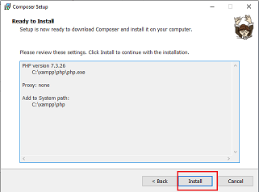
\
&nbsp;

## Postman

* * *
  Postman is an API platform for building and using APIs. Postman simplifies each step of the API lifecycle and streamlines collaboration so you can create better APIs—faster.
  In order to setup postman follow these instructions:

  1. **_Download_** postman from here for [win 64bit](https://dl.pstmn.io/download/latest/win64) or from here for [win 32bit](https://dl.pstmn.io/download/latest/win32)
   \
   &nbsp;
  2. **_Run_** the `installer` and wait for a few minutes
   \
   &nbsp;
  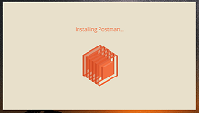 .
  \
   &nbsp;
  3. **Once the installation completes**, you will be redirected to a window as shown in the image where you can click on Stop signing in and take me straight to the app (as this app can also be used without logging in) or otherwise you will get a new window to sign up.
  \
   &nbsp;
  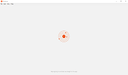
  \
  &nbsp;

## Laravel

* * *
  Laravel is a web application framework with expressive, elegant syntax. A web framework provides a structure and starting point for creating your application, allowing you to focus on creating something amazing while we sweat the details.

  Laravel strives to provide an amazing developer experience while providing powerful features such as thorough dependency injection, an expressive database abstraction layer, queues and scheduled jobs, unit and integration testing, and more.

  Whether you are new to PHP or web frameworks or have years of experience, Laravel is a framework that can grow with you. We'll help you take your first steps as a web developer or give you a boost as you take your expertise to the next level. We can't wait to see what you build.

### Why Laravel?

  There are a variety of tools and frameworks available to you when building a web application. However, we believe Laravel is the best choice for building modern, full-stack web applications.

#### A Progressive Framework

  We like to call Laravel a "progressive" framework. By that, we mean that Laravel grows with you. If you're just taking your first steps into web development, Laravel's vast library of documentation, guides, and video tutorials will help you learn the ropes without becoming overwhelmed.

  If you're a senior developer, Laravel gives you robust tools for dependency injection, unit testing, queues, real-time events, and more. Laravel is fine-tuned for building professional web applications and ready to handle enterprise workloads.

#### A Scalable Framework

  Laravel is incredibly scalable. Thanks to the scaling-friendly nature of PHP and Laravel's built-in support for fast, distributed cache systems like Redis, horizontal scaling with Laravel is a breeze. In fact, Laravel applications have been easily scaled to handle hundreds of millions of requests per month.

  Need extreme scaling? Platforms like Laravel Vapor allow you to run your Laravel application at a nearly limitless scale on AWS's latest serverless technology.

#### A Community Framework

  Laravel combines the best packages in the PHP ecosystem to offer the most robust and developer-friendly framework available. In addition, thousands of talented developers from around the world have contributed to the framework. Who knows, maybe you'll even become a Laravel contributor.

### How to install laravel?

- Open Command-Prompt as an administrator and run this command in order to install `laravel installer` as a global `composer` dependency:
  
  ```sh
    composer global require laravel/installer
  ```

- **Install vs code extensions**
  - Laravel Extension Pack is a collection of extensions for Laravel development.
    - first click on extensions manager(1) and in the search bar write `laravel`(2), finally choose `Laravel Extension Pack`  then click on install as shown below:
  \
  &nbsp;
  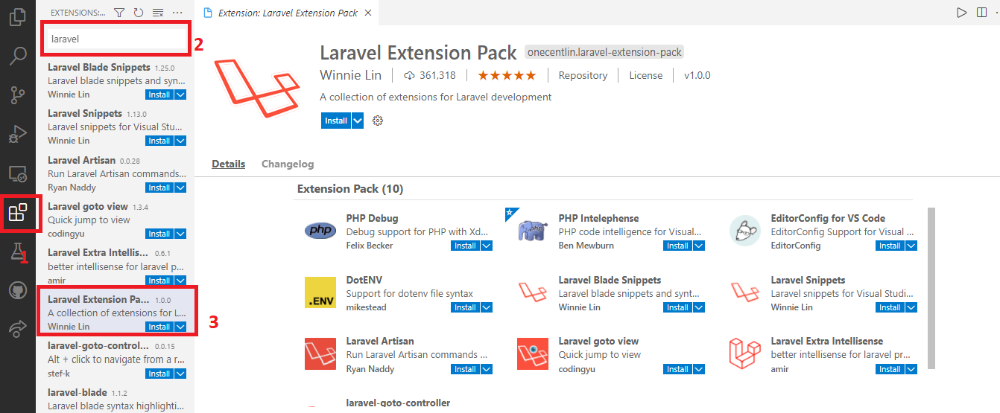

## PhpStorm (optional)

  `PhpStorm` is perfect for working with Symfony, Laravel, Drupal, WordPress, Zend Framework, Magento, Joomla!, CakePHP, Yii, and other frameworks.The editor actually 'gets' your code and deeply understands its structure, supporting all the PHP language features for modern and legacy projects. It provides the best code completion, refactorings, on-the-fly error prevention, and more.
  If you have a good pc/ laptop hardware you can download and install it insted of `Vs code`.
  [Download Link](https://www.jetbrains.com/phpstorm/download/#section=windows)

**Best Regards**
\
&nbsp;
**_Eng. Ali Ibrahim_**&nbsp; &nbsp; &nbsp;**_Eng. Azzam Habib_**
