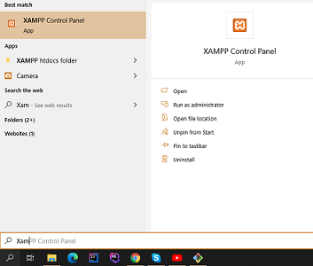
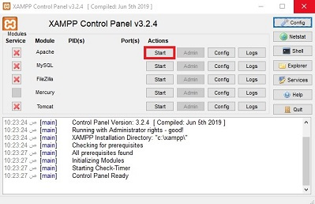
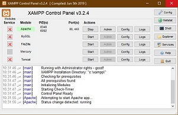

# Session 4: Server-side programming

- [Session 4: Server-side programming](#session-4-server-side-programming)
  - [PHP Introduction](#php-introduction)
  - [What can PHP do?](#what-can-php-do)
  - [Basic Syntax](#basic-syntax)
    - [Types](#types)
    - [Variables](#variables)
      - [Variable scope](#variable-scope)
    - [Constants](#constants)
    - [Expressions](#expressions)
    - [Control Structure](#control-structure)
    - [Functions](#functions)
    - [Classes and Ob](#classes-and-ob)
    - [Exceptions and Error](#exceptions-and-error)

## PHP Introduction

`PHP` is a widely-used open source general-purpose scripting language that is especially suited for web development and can be embedded into HTML.
Nice, but what does that mean? An example:

> Example #1 An introductory example

```php
    <?php
        echo "Hello, I'm a PHP script!";
    ?>
```

What distinguishes `PHP` from something like client-side `JavaScript` is that the code is executed on the server, generating `HTML` which is then sent to the client. The client would receive the results of running that script, but would not know what the underlying code was. You can even configure your web server to process all your `HTML` files with `PHP`, and then there's really no way that users can tell what you have up your sleeve.
The best things in using `PHP` are that it is extremely simple for a newcomer, but offers many advanced features for a professional programmer. Don't be afraid reading the long list of PHP's features. You can jump in, in a short time, and start writing simple scripts in a few hours.

## What can PHP do?

PHP is mainly focused on server-side scripting, so you can do anything any other CGI program can do, such as collect form data, generate dynamic page content, or send and receive cookies. But PHP can do much more.

There are three main areas where PHP scripts are used.

- Server-side scripting. This is the most traditional and main target field for PHP. You need three things to make this work: the PHP parser (CGI or server module), a web server and a web browser. You need to run the web server, with a connected PHP installation. You can access the PHP program output with a web browser, viewing the PHP page through the server. All these can run on your home machine if you are just experimenting with PHP programming.

- Command line scripting. You can make a PHP script to run it without any server or browser. You only need the PHP parser to use it this way. This type of usage is ideal for scripts regularly executed using cron (on *nix or Linux) or Task Scheduler (on Windows). These scripts can also be used for simple text processing tasks.
  
- Writing desktop applications. PHP is probably not the very best language to create a desktop application with a graphical user interface, but if you know PHP very well, and would like to use some advanced PHP features in your client-side applications you can also use PHP-GTK to write such programs. You also have the ability to write cross-platform applications this way. PHP-GTK is an extension to PHP, not available in the main distribution

- With PHP you are not limited to output HTML. PHP's abilities includes outputting images, PDF files and even Flash movies (using libswf and Ming) generated on the fly. You can also output easily any text, such as XHTML and any other XML file. PHP can autogenerate these files, and save them in the file system, instead of printing it out, forming a server-side cache for your dynamic content.

- One of the strongest and most significant features in PHP is its support for a wide range of databases. Writing a database-enabled web page is incredibly simple using one of the database specific extensions (e.g., for mysql), or using an abstraction layer like PDO, or connect to any database supporting the Open Database Connection standard via the ODBC extension. Other databases may utilize cURL or sockets, like CouchDB.

- PHP also has support for talking to other services using protocols such as LDAP, IMAP, SNMP, NNTP, POP3, HTTP, COM (on Windows) and countless others. You can also open raw network sockets and interact using any other protocol. PHP has support for the WDDX complex data exchange between virtually all Web programming languages. Talking about interconnection, PHP has support for instantiation of Java objects and using them transparently as PHP objects.

## Basic Syntax

- Create a file named `hello.php` and put it in your web server's root directory (DOCUMENT_ROOT) in our case in `c:\xampp\htdocs\se2\` then write  the following content:

```html
    <html>
        <head>
            <title>PHP Test</title>
        </head>
        <body>
            <?php echo '<p>Hello World</p>'; ?> 
        </body>
    </html>
```

- Run Xampp control panal like this:
    &nbsp;
    
    &nbsp;
- Press on `Start`
    &nbsp;
    
    &nbsp;
- You will see a green background on `Apache`, that means the apache server has started
    &nbsp;
    
    &nbsp;
- Use your browser to access the file with your web server's URL, ending with the /hello.php file reference. When developing locally this URL will be something like <http://localhost/se2/hello.php> or <http://127.0.0.1/se2/hello.php> but this depends on the web server's configuration. If everything is configured correctly, this file will be parsed by PHP and the following output will be sent to your browser:

    ```html

        <html>
            <head>
                <title>PHP Test</title>
            </head>
            <body>
                <p>Hello World</p>
            </body>
        </html>
    ```

This program is extremely simple and you really did not need to use PHP to create a page like this. All it does is display: Hello World using the PHP `echo` statement. Note that the file does not need to be executable or special in any way. The server finds out that this file needs to be interpreted by PHP because you used the ".php" extension, which the server is configured to pass on to PHP. Think of this as a normal HTML file which happens to have a set of special tags available to you that do a lot of interesting things.

When PHP parses a file, it looks for opening and closing tags, which are <?php and ?> which tell PHP to start and stop interpreting the code between them. Parsing in this manner allows PHP to be embedded in all sorts of different documents, as everything outside of a pair of opening and closing tags is ignored by the PHP parser.
  PHP includes a short echo tag <?= which is a short-hand to the more verbose <?php echo.

> Example #1 PHP Opening and Closing Tags

```php
    <?php echo 'if you want to serve PHP code in XHTML or XML documents,use these tags'; ?>
```

> You can use the short echo tag to

```php
    <?= 'print this string' ?>.
```

PHP supports `C`, `C++` and `Unix` shell-style (Perl style) **comments**.For example:

```php
    <?php
        echo 'This is a test'; // This is a one-line c++ style comment
        /* This is a multi line comment
        yet another line of comment */
        echo 'This is yet another test';
        echo 'One Final Test'; # This is a one-line shell-style comment
    ?>
```

### Types

PHP supports ten primitive types.

Four scalar types:

- bool
- int
- float (floating-point number, aka double)
- string

Four compound types:

- array
- object
- callable
- iterable

And finally two special types:

- resource
- NULL

**_NOTE_**
> The type of a variable is not usually set by the programmer; rather, it is decided at runtime by PHP depending on the context in which that variable is used.
> To check the type and value of an expression, use the var_dump() function.
To get a human-readable representation of a type for debugging, use the gettype() function. To check for a certain type, do not use gettype(), but rather the is_type functions.

Some examples:

```php
    <?php
        $a_bool = TRUE;   // a boolean
        $a_str  = "foo";  // a string
        $a_str2 = 'foo';  // a string
        $an_int = 12;     // an integer

        echo gettype($a_bool); // prints out:  boolean
        echo gettype($a_str);  // prints out:  string

        // If this is an integer, increment it by four
        if (is_int($an_int)) {
            $an_int += 4;
        }

        // If $a_bool is a string, print it out
        // (does not print out anything)
        if (is_string($a_bool)) {
            echo "String: $a_bool";
        }
    ?>
```

### Variables

- Variables in PHP are represented by a dollar sign `$` followed by the name of the variable. The variable name is **_case-sensitive_**.
Variable names follow the same rules as other labels in PHP. A valid variable name starts with a letter or underscore, followed by any number of letters, numbers, or underscores. As a regular expression, it would be expressed thus: `^[a-zA-Z_\x80-\xff][a-zA-Z0-9_\x80-\xff]*$`

Example:

```php
    <?php
        $var = 'Ali';
        $Var = 'Ibrahim';
        echo "$var, $Var";      // outputs "Ali, Ibrahim"

        $4site = 'not yet';     // invalid; starts with a number
        $_4site = 'not yet';    // valid; starts with an underscore
        $täyte = 'mansikka';    // valid; 'ä' is (Extended) ASCII 228.
    ?>
```

- By default, variables are always assigned by value. That is to say, when you assign an expression to a variable, the entire value of the original expression is copied into the destination variable. This means, for instance, that after assigning one variable's value to another, changing one of those variables will have no effect on the other

- PHP also offers another way to assign values to variables: assign by reference. This means that the new variable simply references (in other words, "becomes an alias for" or "points to") the original variable. Changes to the new variable affect the original, and vice versa.

- To assign by reference, simply prepend an ampersand (&) to the beginning of the variable which is being assigned (the source variable). For instance, the following code snippet outputs 'My name is Bob' twice:
  
  ```php
    <?php
        $foo = 'Bob';              // Assign the value 'Bob' to $foo
        $bar = &$foo;              // Reference $foo via $bar.
        $bar = "My name is $bar";  // Alter $bar...
        echo $bar;
        echo $foo;                 // $foo is altered too.
    ?>  
  ```

- **Note:** One important thing to note is that only named variables may be assigned by reference.
  
  ```php
    <?php
        $foo = 25;
        $bar = &$foo;      // This is a valid assignment.
        $bar = &(24 * 7);  // Invalid; references an unnamed expression.

        function test()
        {
        return 25;
        }

        $bar = &test();    // Invalid.
    ?>
  ```

- It is not necessary to initialize variables in PHP however it is a very **good practice**. Uninitialized variables have a `default` value of their type depending on the context in which they are used - booleans default to false, integers and floats default to zero, strings (e.g. used in echo) are set as an empty string and arrays become to an empty array.
  Example #1 Default values of uninitialized variables

  ```php
    <?php
        // Unset AND unreferenced (no use context) variable; outputs NULL
        var_dump($unset_var);

        // Boolean usage; outputs 'false' (See ternary operators for more on this syntax)
        echo($unset_bool ? "true\n" : "false\n");

        // String usage; outputs 'string(3) "abc"'
        $unset_str .= 'abc';
        var_dump($unset_str);

        // Integer usage; outputs 'int(25)'
        $unset_int += 25; // 0 + 25 => 25
        var_dump($unset_int);

        // Float/double usage; outputs 'float(1.25)'
        $unset_float += 1.25;
        var_dump($unset_float);

        // Array usage; outputs array(1) {  [3]=>  string(3) "def" }
        $unset_arr[3] = "def"; // array() + array(3 => "def") => array(3 => "def")
        var_dump($unset_arr);

        // Object usage; creates new stdClass object (see http://www.php.net/manual/en/reserved.classes.php)
        // Outputs: object(stdClass)#1 (1) {  ["foo"]=>  string(3) "bar" }
        $unset_obj->foo = 'bar';
        var_dump($unset_obj);
    ?>
  ```

#### Variable scope

- The scope of a variable is the context within which it is defined. For the most part all PHP variables only have a single scope. This single scope spans included and required files as well. For example:
  
  ```php
    <?php
        $a = 1;
        include 'b.inc';
    ?>
  ```

- Here the `$a` variable will be available within the included b.inc script. However, within user-defined functions a local function scope is introduced. Any variable used inside a function is by default limited to the local function scope. For example:
  
  ```php
    <?php
        $a = 1; /* global scope */ 

        function test()
        { 
            echo $a; /* reference to local scope variable */ 
        } 

        test();
    ?>
  ```

- This script will not produce any output because the echo statement refers to a local version of the $a variable, and it has not been assigned a value within this scope. You may notice that this is a little bit different from the C language in that global variables in C are automatically available to functions unless specifically overridden by a local definition. This can cause some problems in that people may inadvertently change a global variable. In PHP global variables must be declared global inside a function if they are going to be used in that function.
- **The** `global` **keyword**
  - Example #1 Using global:

  ```php
    <?php
        $a = 1;
        $b = 2;

        function Sum()
        {
            global $a, $b;

            $b = $a + $b;
        } 

        Sum();
        echo $b;
    ?> 
  ```
  
  - The above script will output 3. By declaring `$a` and `$b` global within the function, all references to either variable will refer to the global version. There is no limit to the number of global variables that can be manipulated by a function.
  - A second way to access variables from the global scope is to use the special PHP-defined `$GLOBALS` array. The previous example can be rewritten as:
  Example #2 Using **_$GLOBALS_** instead of global:
  &nbsp;

  ```php
    <?php
        $a = 1;
        $b = 2;

        function Sum()
        {
            $GLOBALS['b'] = $GLOBALS['a'] + $GLOBALS['b'];
        } 

        Sum();
        echo $b;
    ?>
  ```

  - The `$GLOBALS` array is an associative array with the name of the global variable being the key and the contents of that variable being the value of the array element. Notice how `$GLOBALS` exists in any scope, this is because `$GLOBALS` is a superglobal.
    &nbsp;

    ```php
        <?php
            function test_superglobal()
            {
                echo $_POST['name'];
            }
        ?>
    ```

- **Using** `static` **variables**
  - Another important feature of variable scoping is the static variable. A static variable exists only in a local function scope, but it does not lose its value when program execution leaves this scope. Consider the following example:

    ```php
        <?php
            //Example #4: demonstrating need for static variables
            function test()
            {
                $a = 0;
                echo $a;
                $a++;
            }
        ?>
    ```

  - This function is quite useless since every time it is called it sets `$a` to 0 and prints 0. The `$a++` which increments the variable serves no purpose since as soon as the function exits the `$a` variable disappears. To make a useful counting function which will not lose track of the current count, the `$a` variable is declared static.

    ```php
        <?php
            //Example #5: Example use of static variables
            function test()
            {
                static $a = 0;
                echo $a;
                $a++;
            }
        ?>
    ```
  
  - Static variables also provide one way to deal with recursive functions. A recursive function is one which calls itself. Care must be taken when writing a recursive function because it is possible to make it recurse indefinitely. You must make sure you have an adequate way of terminating the recursion. The following simple function recursively counts to 10, using the static variable $count to know when to stop:

    ```php
        <?php
            //Example #6: Static variables with recursive functions
            function test()
            {
                static $count = 0;

                $count++;
                echo $count;
                if ($count < 10) {
                    test();
                }
                $count--;
            }
        ?>
    ```

  - Static variables can be assigned values which are the result of constant expressions, but dynamic expressions, such as function calls, will cause a parse error.

    ```php
        <?php
            //Example #7: Declaring static variables
            function foo()
            {
                static $int = 0;          // correct 
                static $int = 1+2;        // correct
                static $int = sqrt(121);  // wrong  (as it is a function)

                $int++;
                echo $int;
            }
        ?>
    ```

    >**Note**
    Static declarations are resolved in compile-time.
- You can read more about [References with global and static variables](https://www.php.net/manual/en/language.variables.scope.php#language.variables.scope.references) ,[Variable variables](https://www.php.net/manual/en/language.variables.variable.php) and [Variables From External Sources](https://www.php.net/manual/en/language.variables.external.php). **_`Reading is optional`_**

### Constants

### Expressions

### Control Structure

### Functions

### Classes and Ob

### Exceptions and Error
