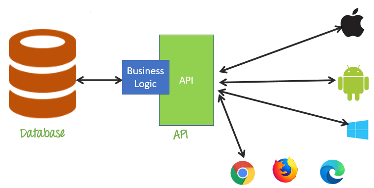

# Session 5: Application Programming Interface- Part1

**Table of content**

- [Session 5: Application Programming Interface- Part1](#session-5-application-programming-interface--part1)
  - [Web Services - Introduction](#web-services---introduction)
    - [Types of Web Services](#types-of-web-services)
  - [Application Programming Interface](#application-programming-interface)
    - [Introduction](#introduction)
    - [Why we need API](#why-we-need-api)
    - [Difference Between API and Web Service](#difference-between-api-and-web-service)
    - [REST](#rest)
      - [Brief](#brief)
      - [Principles of REST](#principles-of-rest)
  - [Model-View-Controller(MVC)](#model-view-controllermvc)
    - [Model](#model)
    - [View](#view)
    - [Controller](#controller)
    - [MVC Examples](#mvc-examples)
    - [Advantages and Disadvantages of MVC](#advantages-and-disadvantages-of-mvc)

## Web Services - Introduction

- There is more than one way to answer, “What is a web service?” But, essentially, **_web services_** include any software, application, or cloud technology that provides standardized web protocols (HTTP or HTTPS) to interoperate, communicate, and exchange data messaging – usually XML (Extensible Markup Language) – throughout the internet.
- In other words, web services are XML-centered data exchange systems that use the internet for A2A (application-to-application) communication and interfacing. These processes involve programs, messages, documents, and/or objects.
- A complete web service is, therefore, any service that:
  - Available over the internet or intranet networks.
  - Standardized messaging system.
  - Independent of a single operating system or programming language.
  - Self-describing via standard language(XML, JSON, etc..).
  - Discoverable through a simple location method.
  
### Types of Web Services

There are a few central types of web services: XML-RPC, UDDI, SOAP, and REST.

- **XML-RPC (Remote Procedure Call)** is the most basic XML protocol to exchange data between a wide variety of devices on a network. It uses HTTP to quickly and easily transfer data and communication other information from client to server.
- **UDDI (Universal Description, Discovery, and Integration)** is an XML-based standard for detailing, publishing, and discovering web services. It’s basically an internet registry for businesses around the world. The goal is to streamline digital transactions and e-commerce among company systems.
- **SOAP (Simple Object Access Protocol)**, is an XML-based Web service protocol to exchange data and documents over HTTP or SMTP (Simple Mail Transfer Protocol). It allows independent processes operating on disparate systems to communicate using XML.
- **REST (Representational State Transfer)**, _which will  be described in great detail later_, provides communication and connectivity between devices and the internet for API-based tasks. Most RESTful services use HTTP as the supporting protocol.

## Application Programming Interface

### Introduction

You might have heard the word “API” and wondered “What the hell is this?”, When you are using a mobile phone and accessing an application installed on the phone, you are using an API. It can be either a status update in Facebook or Finding a location on Google Maps. At that time, you are using an API.
What is this API means… Let’s see what exactly is this API.

- API is just an acronym for **Application Programming Interface**.
- It is a software intermediary that allows two applications to talk to each other. It is the medium through which Frontend and Backend communicate with each other.We won’t go into much technical detail, let’s just keep it simple.\
\
&nbsp;


- Let’s take an example of a Restaurant.A restaurant has two ends (applications in our definition).Frontend which is all the Tables, Chairs and decor, where the actual customer(user) sits and interacts mostly.The Backend which is the kitchen. Now, when a customer enters the restaurant it is not that the customer’s themselves will go to the kitchen(backend), get whatever they want, go back(frontend), sit and eat.This doesn’t sound great.
- So, we need to have some kind of medium to get your order to the kitchen and deliver your food back to your table. This is where the waiter comes into the picture. Yeah, you guessed it right, waiter is our API.
\
&nbsp;


- The waiter(API) takes your order(request) and informs the kitchen(backend). based on what you have ordered(requested) waiter deliver your food(response). Now, it sounds good. This is what an API is, a link between two endpoints/applications.

### Why we need API

- Let's imagine this, If my website wants to use login information from Facebook, I will have to use the Facebook API. What this does, is that it gives me my login details from the Facebook database rather than creating a new database.
- So in my question details, I wanted to retrieve data from the database and display it on the app, since I own the database, I wouldn't need an API. But in the future if there is a third party app that wants to use my database, then for that purpose I will have to create an API.
- Consider a situation where you want to retrieve some data from a website, say a list of new items from Product app. Suppose there were no APIs, your developer wants to go to the website, then manually do the scrapping and complicate with the data.This will consume a lot of time which actually effect the app development, instead he gets focused on data. The similar applies for retrieving data from a db. Now suppose there is an API, the developer can retrieve the data easily, or even update the data without downloading entire data to apps backend.
- Simply an API helps the developer to think less on the data and concentrate more on the app development and front-end.
- Once you have an API you can easily move and launch your cross-platform apps and scaling up.

### Difference Between API and Web Service

- API and Web service serve as a means of communication. The only difference is that a Web service facilitates interaction between two machines over a network.
- An API acts as an interface between two different applications so that they can communicate with each other.
- An API is a method by which the third-party vendors can write programs that interface easily with other programs.
- A Web service is designed to have an interface that is depicted in a machine-processable format usually specified in Web Service Description Language (WSDL).Typically, “HTTP” is the most commonly used protocol for communication.
- Web service also uses SOAP, REST, and XML-RPC as a means of communication. API may use any means of communication to initiate interaction between applications.For example, the system calls are invoked using interrupts by the Linux kernel API.
- An API exactly defines the methods for one software program to interact with the other. When this action involves sending data over a network, Web services come into the picture. An API generally involves calling functions from within a software program.
- In case of Web applications, the API used is web based. Desktop applications such as spreadsheets and word documents use VBA and COM-based APIs which don’t involve Web service.
- A server application such as Joomla may use a PHP-based API present within the server which doesn’t require Web service.
A Web service is merely an API wrapped in HTTP.
- An API doesn’t always need to be web based. An API consists of a complete set of rules and specifications for a software program to follow in order to facilitate interaction. A Web service might not contain a complete set of specifications and sometimes might not be able to perform all the tasks that may be possible from a complete API.
- The APIs can be exposed in a number of ways which include: COM objects, DLL and .H files in C/C++ programming language, JAR files or RMI in Java, XML over HTTP, JSON over HTTP, etc. The method used by Web service to expose the API is strictly through a network

In Summary:

1. All Web services are APIs but all APIs are not Web services.
2. Web services might not perform all the operations that an API would perform.
3. A Web service uses only three styles of use: SOAP, REST and XML-RPC for
communication whereas API may use any style for communication.
4. A Web service always needs a network for its operation whereas an API doesn’t need
a network for its operation.
5. An API facilitates interfacing directly with an application whereas a Web service interacts with two machines over a network.
6. web service is like advanced Urls and API is Programmed Interface.
7. API contains classes and Interfaces just like a program.
8. A web service is a form of API (Application Programming Interface).
9. An API is used by a computer programmer to establish a link between software applications. This interface can take several forms, a web service is just one of these.
10. There are several types of web service. SOAP (Simple Object Access Protocol) is one of the most common. The API takes the form of a service description (WSDL) which is used to automatically generate the program code which makes the connection

### REST

#### Brief

- **REST, or REpresentational State Transfer**, is an architectural style for providing standards between computer systems on the web, making it easier for systems to communicate with each other. REST-compliant systems, often called RESTful systems, are characterized by how they are stateless and separate the concerns of client and server. We will go into what these terms mean and why they are beneficial characteristics for services on the Web.
- In the REST architectural style, the implementation of the client and the implementation of the server can be done independently without each knowing about the other. This means that the code on the client side can be changed at any time without affecting the operation of the server, and the code on the server side can be changed without affecting the operation of the client.
- As long as each side knows what format of messages to send to the other, they can be kept modular and separate. Separating the user interface concerns from the data storage concerns, we improve the flexibility of the interface across platforms and improve scalability by simplifying the server components. Additionally, the separation allows each component the ability to evolve independently.
- By using a REST interface, different clients hit the same REST endpoints, perform the same actions, and receive the same responses

#### Principles of REST

- In order for your APIs to be RESTful, you have to follow a set of constraints when you write them. The REST set of constraints will make your APIs easier to use and also easier to discover, meaning a developer who is just starting to use your APIs will have an easier time learning how to do so.
- The key abstraction of information in REST is a **resource**.
- Any information that we can name can be a resource. For example, a REST resource can be a document or image, a temporal service, a collection of other resources, or a non-virtual object (e.g., a person).
- The state of the resource, at any particular time, is known as the **_resource representation_**
- The resource representations are consist of:
  - the data.
  - the metadata describing the data.
  - the hypermedia links that can help the clients in transition to the next desired state.

\
&nbsp;
\
&nbsp;
\
&nbsp;
**Note**
> A REST API consists of an assembly of interlinked resources. This set of resources is known as the REST API’s resource model.

- REST uses resource identifiers to identify each resource involved in the interactions between the client and the server components.
- The six guiding principles or constraints of the RESTful architecture are:
  1. **Uniform Interface**
  The following four constraints can achieve a uniform REST interface:
     1. **Identification of resources** – The interface must uniquely identify each resource involved in the interaction between the client and the server.
     2. **Manipulation of resources through representations** – The resources should have uniform representations in the server response. API consumers should use these representations to modify the resources state in the server.
     3. **Self-descriptive messages** – Each resource representation should carry enough information to describe how to process the message. It should also provide information of the additional actions that the client can perform on the resource.
     4. **Hypermedia as the engine of application state** – The client should have only the initial URI of the application. The client application should dynamically drive all other resources and interactions with the use of hyperlinks.
  2. **Client-server**
     The client-server design pattern enforces the separation of concerns, which helps the client and the server components evolve independently.
     By separating the user interface concerns (client) from the data storage concerns (server), we improve the portability of the user interface across multiple platforms and improve scalability by simplifying the server components.
     While the client and the server evolve, we have to make sure that the interface/contract between the client and the server does not break.
  3. **Stateless**
    Statelessness mandates that each request from the client to the server must contain all the information necessary to understand and complete the request.
    The server cannot take advantage of any previously stored context information on the server.
    For this reason, the client application must entirely keep the session state
  4. **Cacheable**
     The cacheable constraint requires that a response should implicitly or explicitly label itself as cacheable or non-cacheable.
     If the response is cacheable, the client application gets the right to reuse the response data later for equivalent requests and a specified period.
  5. **Layered system**
     The layered system style allows an architecture to be composed of hierarchical layers by constraining component behavior.
     For example, in a layered system, each component cannot see beyond the immediate layer they are interacting with.
  6. **Code on demand** : REST also allows client functionality to extend by downloading and executing code in the form of applets or scripts. The downloaded code simplifies clients by reducing the number of features required to be pre-implemented. Servers can provide part of features delivered to the client in the form of code, and the client only needs to execute the code.

\
&nbsp;
\
&nbsp;
\
&nbsp;

## Model-View-Controller(MVC)

- MVC stands for Model-View-Controller. It is an architecture or a software design pattern that makes creating huge applications easy. It does not belong to specific programming language or framework, but it is a concept that you can use in creating any kind of application or software in any programming language.
- For example, if you are developing an application in PHP, you can use frameworks like Laravel or Codeigniter that uses MVC architecture to help you develop applications fast and simple. It might be a little hard to get your head around the MVC structure at first if you have created very simple applications without using any kind of architecture or framework. But, this guide is to explain to you how to work on MVC architecture. Once you will understand how it works, you will just love working on MVC.

Here is how MVC architecture works in a simple and easy to understand illustration.


- The architecture we are talking about right now contains three different parts. The different parts are Model, View and Controller. Each one of them plays an important role in application development. Let us learn about these three parts of the architecture in detail.
- The different versions of MVC later came into existence with the requirement for application designing. These are:
  - Hierarchical model-view-controller (HMVC).
  - Model-view-presenter (MVP).
  - Model-view-adapter (MVA).
  - Model-view-viewmodel (MVVM) and some others.

### Model

- Model works directly with the database. It does not have to deal with user interface or data processing. In real world scenario, you will simply use model to fetch, insert, update and delete data from your database.
- To explain it practically, imagine we are creating a task management application that will simply allow user to organise tasks based on date and time. It means that we will have users and tasks to manage in our database. In the language of MVC, User and Task are models in our application.
- So, what we will do is we will create two models in our application named User and Task. Note that models also have relationships with each other. In this case, Every task belongs to a specific user, and a user might have multiple tasks. So, we will have one method in our User model to fetch all the user’s tasks, and we will have one method in our Task model that will fetch a user.
- In addition to that, we will also have some methods in both the models like Create, Update, Delete in our models that will simply delete a record from our table. For example, if you want to create a user account, you just have to run the following code.

```php
$user = User::create([
    'firstname' => 'John',
    'lastname' => 'Doe',
    'email' => 'johndoe@example.com',
]);
```

- This code follows PHP syntax, but you can do the same thing in any programming language. Now, Let’s say user requested to change the name in our database. Here is what we will do to update our model.

```php
$user = User::where('email','johndoe@example.com')->first();
$user->firstname = 'John2';
$user->lastname = 'Doe2';
$user->save();
```

- And to delete a specific user, we just have to use the Delete method of our model which will delete the user account along with all the task that a user has on our system (Foreign key). To show all the data, we use MVC architecture View in our application.

### View

- In simple words, View is the User Interface on which our customer/user can perform some actions. It contains HTML,CSS,JS, XML or any other markup language that we can use to create a beautiful user interface. It also contains code to show the data that it receives form our application.
- The only two things that a View has to do is to show data to the customer/user on User Interface and to respond to the events. For example, What to do when a user clicks on Update or Delete button? The answer is, user should be redirected to the Update form or to delete confirmation popup.
- Now, It’s time we show our customers/users the task they have in our example task management application. We will show it in tabular format. Right now, we can fetch all the tasks of a specific user using our Model. And somehow, Let’s consider that we have all the tasks of a specific user in a $tasks variable.
- To show the data, we will simply create a view with all the HTML markup. And we will run a for or foreach or while loop to iterate through the $tasks variable. And, we will also put the links to Update and Delete URLs. The view in account is called Index view. It will only show the list of tasks in tabular format. We will also create and Update views for our Task model.
- Similarly, Register is a Create view for our User model. And the list of all the users in our admin panel is the Index view of our User model. So, In short, View is the user interface that displays data and sends the events like update, delete and create to the respective controller.

### Controller

- Now comes the most interesting part of the architecture, Controller. Controller is the part in which we process the data after we get a request from View and before updating anything in our database with our Model.
- Imagine, the homepage of our application prompts user to enter three tasks that he wants to manage in our application. Once he enters those three tasks, he is redirected to the registration form along with these three tasks. And after registration, those three tasks will appear in the dashboard.
- Controller makes it easier for us to manage such scenarios. It is because Controller contains the functions that we can program however we want. For example, After receiving the data in our UserController in the Store method, we will simply create a user account. After creating a user account, we will check if there are any tasks that a user has submitted along with the name and email.
- If user has submitted the tasks, we will also create user’s tasks before returning the “Registration successful” message to the Register view.
- In our task management application, we will have two controllers named UserController and TaskController. Controllers contain the methods like Create, Update, Destroy, Store and Show. In case if user accesses the Index or Show or Update view, it will simply fetch the data from model and return it to the View in a variable.

### MVC Examples

**Example1**


- Let’s assume you go to a restaurant. You will not go to the kitchen and prepare food which you can surely do at your home. Instead, you go there and wait for the waiter to come on.
- Now the waiter comes to you, and you order the food. The waiter doesn’t know who you are and what you want he has just written down the detail of your food order.
- Then, the waiter moves to the kitchen. In the kitchen, waiter does not prepare your food.
- The cook prepares your food. The waiter is given your order to him along with your table number.
- Cook then prepared food for you. He uses ingredients to cooks the food. Let’s assume that your order a vegetable sandwich. Then he needs bread, tomato, potato, capsicum, onion, bit, cheese, etc. which he sources from the refrigerator
- Cook final hand over the food to the waiter. Now it is the job of the waiter to moves this food outside the kitchen.
Now waiter knows which food you have ordered and how they are served
In this MVC architecture example,

```text
View= You
Waiter= Controller
Cook= Model
Refrigerator= Data
```

**Example2**


Car driving mechanism is another example of the MVC model.

- Every car consist of three main parts.
View= User interface : (Gear lever, panels, steering wheel, brake, etc.).
- Controller- Mechanism (Engine).
- Model- Storage (Petrol or Diesel tank)
- Car runs from engine take fuel from storage, but it runs only using mentioned user interface devices.

Here, is a list of some popular MVC frameworks:

- Laravel
- Symphony
- Django
- CakePHP
- Yii
- CherryPy
- Spring MVC
- Catalyst
- Rails
- Zend Framework
- CodeIgniter
- Fuel PHP
- Ruby on Rails

### Advantages and Disadvantages of MVC

Here, are major benefits of using MVC architecture:

- Easy code maintenance which is easy to extend and grow
MVC Model component can be tested separately from the user
Easier support for new types of clients
Development of the various components can be performed parallel.
- It helps you to avoid complexity by dividing an application into the three units. Model, view, and controller
- It only uses a Front Controller pattern which process web application requests through a single controller.
Offers the best support for test-driven development.
- It works well for Web apps which are supported by large teams of web designers and developers.
- Provides clean separation of concerns(SoC).
Search Engine Optimization (SEO) Friendly.
- All classes and objects are independent of each other so that you can test them separately.
- MVC design pattern allows logical grouping of related actions on a controller together.

The disadvantages are:

- Difficult to read, change, unit test, and reuse this model
The framework navigation can some time complex as it introduces new layers of abstraction which requires users to adapt to the decomposition criteria of MVC.
- No formal validation support.
- Increased complexity and Inefficiency of data
- The difficulty of using MVC with the modern user interface
- There is a need for multiple programmers to conduct parallel programming.
- Knowledge of multiple technologies is required.
- Maintenance of lots of codes in Controller

\
&nbsp;
\
&nbsp;
\
&nbsp;
\
&nbsp;
\
&nbsp;
\
&nbsp;
\
&nbsp;
\
&nbsp;
\
&nbsp;
\
&nbsp;
\
&nbsp;

