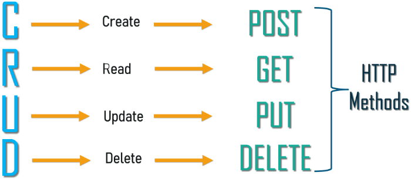

# Session 6: Application Programming Interface- Part2

**Table of content**

- [Session 6: Application Programming Interface- Part2](#session-6-application-programming-interface--part2)
  - [Hyper-Text Transfer Protocol (HTTP)](#hyper-text-transfer-protocol-http)
    - [Request life cycle](#request-life-cycle)
    - [HTTP methods](#http-methods)
      - [HTTP GET](#http-get)
      - [HTTP POST](#http-post)
      - [HTTP PUT](#http-put)
      - [HTTP DELETE](#http-delete)
      - [HTTP PATCH](#http-patch)
    - [HTTP Response status code](#http-response-status-code)
    - [CRUD](#crud)
  - [Javascript Object Notation (JSON)](#javascript-object-notation-json)
    - [Data Types used with JSON](#data-types-used-with-json)

## Hyper-Text Transfer Protocol (HTTP)

### Request life cycle


- The web is a cycle of requests and responses that flow between clients and servers.
\
&nbsp;
- **What is a client?**
  - A client is a piece of computer hardware or software that accesses a service made available by a server. Generally, clients are web browsers (like Chrome or Firefox), but clients can also be API’s making requests to another server or the command line (when making cURL requests).
\
&nbsp;
- **What is an HTTP request?**
  - AN HTTP request is a text string generated by the client and sent to the server containing the specifications of the resource the client is asking for. A resource is anything that can accessed via the web. The HTTP request communicates which resource a client wants to interact with and how the client wants to interact with it, along with some metadata held in the header related to the request.
  - The resource the client wants to interact with is communicated through the URL that is sent with the request. For example, if a user entered <http://twitter.com> into their web browser, the web browser would send a request to the server looking for the Twitter resource.
\
&nbsp;
- **What is an HTTP response?**
  - An HTTP response is what is sent by a server to a client in response to an HTTP request. These responses contain a status code and if the request was successful, the requested resource.
  - HTTP responses also include a message body. If the client is a browser, the HTML body is generally an HTML page that the browser can then render. If the client is an API or Command Line, the message body could be a JSON or XML steam. An HTTP response would also contain a header with metadata related to the response, similar to an HTTP request header.
\
&nbsp;
- **How does the server know what to respond with?**
  - All resources are hosted on a server. The server’s location on the web can be identified by its IP address, however, IP addresses aren’t particularly user-friendly, and instead we use URLS (such as <http://www.google.co.uk>) to search for a resource.
  - Once the client’s request has reached the server, the server will search for and return the information the client is requesting. Often times, this means querying a database, loading the information into a html page, and returning the HTML text to the user in the body of the HTTP response.
\
&nbsp;
- **What happens once the client receives the HTTP response back from the server?**
  - Once the client receives the HTTP response, the browser will render the HTTP response body message. This message is either the requested resource (for example, a web page) or display a message relating to status code if the request wasn’t successful.

Let's look at this scenario

- If you go to www.google.com (not using any forms, just wanting the site), this is what happens:
  1. First the browser needs to translate www.google.com to an IP address if it does not already know it. If it knows it, nothing happens at this point. If it does not know it, it contacts a DNS server to resolve the name.
  2. Then browser will open a TCP connection to the IP address of www.google.com and send an HTTP GET request over. In this example it will be

  ```text
  GET / HTTP/1.1   Host: www.google.com
  ```

  3. The server software will get this HTTP request. It will somehow generate an HTTP response and send that back through the TCP connection. How the server does this is server software dependent. You can for example plug in application code in Apache, or just make Apache return a file from the filesystem. PHP is an application called by some software, which then generates the response sent to the browser. When the response is sent, in HTTP version 1.0 the connection is closed. HTTP 1.1 can have persistent connections though
  4. When the browser gets the response, it typically renders it on screen. The HTTP request is now done. A click on "search" will send a new request to the server.

### HTTP methods

- REST APIs enable you to develop any kind of web application having all possible CRUD (create, retrieve, update, delete) operations. REST guidelines suggest using a specific HTTP method on a particular type of call made to the server (though technically it is possible to violate this guideline, yet it is highly discouraged).

#### HTTP GET

- Use GET requests to retrieve resource representation/information only – and not to modify it in any way. As GET requests do not change the state of the resource, these are said to be safe methods.
- Additionally, GET APIs should be idempotent, which means that making multiple identical requests must produce the same result every time until another API (POST or PUT) has changed the state of the resource on the server.
- If the Request-URI refers to a data-producing process, it is the produced data that shall be returned as the entity in the response and not the source text of the process, unless that text happens to be the output of the process.
- For any given HTTP GET API, if the resource is found on the server, then it must return HTTP response code 200 (OK) – along with the response body, which is usually either XML or JSON content (due to their platform-independent nature).
- In case the resource is NOT found on the server then it must return HTTP response code 404 (NOT FOUND).
- Similarly, if it is determined that the GET request itself is not correctly formed then the server will return the HTTP response code 400 (BAD REQUEST).

**_Example request URIs_**

- HTTP GET <http://www.appdomain.com/users>
- HTTP GET <http://www.appdomain.com/users?size=20&page=5>
- HTTP GET <http://www.appdomain.com/users/123>
- HTTP GET <http://www.appdomain.com/users/123/address>

#### HTTP POST

- Use POST APIs to create new subordinate resources, e.g., a file is subordinate to a directory containing it or a row is subordinate to a database table.
- When talking strictly in terms of REST, POST methods are used to create a new resource into the collection of resources.
- Ideally, if a resource has been created on the origin server, the response SHOULD be HTTP response code 201 (Created) and contain an entity that describes the status of the request and refers to the new resource, and a Location header.
- Many times, the action performed by the POST method might not result in a resource that can be identified by a URI. In this case, either HTTP response code 200 (OK) or 204 (No Content) is the appropriate response status.
- Responses to this method are not cacheable unless the response includes appropriate Cache-Control or Expires header fields.
- Please note that POST is neither safe nor idempotent, and invoking two identical POST requests will result in two different resources containing the same information (except resource ids).

**_Example request URIs_**

- HTTP POST <http://www.appdomain.com/users>
- HTTP POST <http://www.appdomain.com/users/123/accounts>

#### HTTP PUT

- Use PUT APIs primarily to update an existing resource (if the resource does not exist, then API may decide to create a new resource or not).
- If a new resource has been created by the PUT API, the origin server MUST inform the user agent via the HTTP response code 201 (Created) response and if an existing resource is modified, either the 200 (OK) or 204 (No Content) response codes SHOULD be sent to indicate successful completion of the request.
- If the request passes through a cache and the Request-URI identifies one or more currently cached entities, those entries SHOULD be treated as stale. Responses to PUT method are not cacheable.

**_NOTE_**
>The difference between the POST and PUT APIs can be observed in request URIs. POST requests are made on resource collections, whereas PUT requests are made on a single resource.

**_Example request URIs_**

- HTTP PUT <http://www.appdomain.com/users/123>
- HTTP PUT <http://www.appdomain.com/users/123/accounts/456>
  
#### HTTP DELETE

- As the name applies, DELETE APIs are used to delete resources (identified by the Request-URI).
- A successful response of DELETE requests SHOULD be an HTTP response code 200 (OK) if the response includes an entity describing the status, 202 (Accepted) if the action has been queued, or 204 (No Content) if the action has been performed but the response does not include an entity.
- DELETE operations are idempotent. If you DELETE a resource, it’s removed from the collection of resources.
- Repeatedly calling DELETE API on that resource will not change the outcome – however, calling DELETE on a resource a second time will return a 404 (NOT FOUND) since it was already removed.
- Some may argue that it makes the DELETE method non-idempotent. It’s a matter of discussion and personal opinion.
- If the request passes through a cache and the Request-URI identifies one or more currently cached entities, those entries SHOULD be treated as stale. Responses to this method are not cacheable.

**_Example request URIs_**

- HTTP DELETE <http://www.appdomain.com/users/123>
- HTTP DELETE <http://www.appdomain.com/users/123/accounts/456>

#### HTTP PATCH

- HTTP PATCH requests are to make a partial update on a resource. If you see PUT requests also modify a resource entity, so to make more clear – the PATCH method is the correct choice for partially updating an existing resource, and PUT should only be used if you’re replacing a resource in its entirety.
- Please note that there are some challenges if you decide to use PATCH APIs in your application:
- Support for PATCH in browsers, servers, and web application frameworks is not universal. IE8, PHP, Tomcat, Django, and lots of other software has missing or broken support for it.

### HTTP Response status code

- HTTP response status codes indicate whether a specific HTTP request has been successfully completed. Responses are grouped in five classes:
  
| **_Class_**    | **_Range_**  |
| -------------- | ----------  |
| Informational responses | 1xx(100-199)  |
| Successful responses | 2xx(200-299)  |
| Redirection messages | 3xx(300-399)  |
| Client error responses  | 4xx(400-499)  |
| Server error responses | 5xx(500-599)  |

| **_Code_** | **_Type_**  | **_Brief_**  |
| ---------- | ----------- | -----------  |
| 100        | Continue    | This interim response indicates that the client should continue the request or ignore the response if the request is already finished|
| 101        | Switching Protocols | This code is sent in response to an Upgrade request header from the client and indicates the protocol the server is switching to.|
| 102        | Processing  | This code indicates that the server has received and is processing the request, but no response is available yet.|
| 200        | OK          | The request succeeded. The result meaning of "success" depends on the HTTP method|
| 201        | Created     | The request succeeded, and a new resource created as a result. This is typically the response sent after POST requests, or some PUT requests|
| 202        | Accepted    | The request has been received but not yet acted upon. It is noncommittal, since there is no way in HTTP to later send an asynchronous response indicating the outcome of the request. It is intended for cases where another process or server handles the request, or for batch processing.|
| 203        | Non-Authoritative Information  | This response code means the returned metadata is not exactly the same as is available from the origin server, but is collected from a local or a third-party copy. This is mostly used for mirrors or backups of another resource. Except for that specific case, the 200 OK response is preferred to this status.|
| 204        | No Content  | There is no content to send for this request, but the headers may be useful. The user agent may update its cached headers for this resource with the new ones|
| 300      | Multiple Choice  | The request has more than one possible response. The user agent or user should choose one of them. (There is no standardized way of choosing one of the responses, but HTML links to the possibilities are recommended so the user can pick.)|
| 301        | Moved Permanently  | The URL of the requested resource has been changed permanently. The new URL is given in the response.|
| 302        | Found  | This response code means that the URI of requested resource has been changed temporarily. Further changes in the URI might be made in the future. Therefore, this same URI should be used by the client in future requests.|
| 303        | See Other  | The server sent this response to direct the client to get the requested resource at another URI with a GET request.|
| 304        | Not Modified  | This is used for caching purposes. It tells the client that the response has not been modified, so the client can continue to use the same cached version of the response.|
| 305        | Use Proxy  |Defined in a previous version of the HTTP specification to indicate that a requested response must be accessed by a proxy. It has been deprecated due to security concerns regarding in-band configuration of a proxy.|
| 400        | Bad Request  |The server could not understand the request due to invalid syntax|
| 401        | Unauthorized  | Although the HTTP standard specifies "unauthorized", semantically this response means "unauthenticated". That is, the client must authenticate itself to get the requested response.|
| 402        | Payment Required   | This response code is reserved for future use. The initial aim for creating this code was using it for digital payment systems, however this status code is used very rarely and no standard convention exists.|
| 403        | Forbidden  | The client does not have access rights to the content; that is, it is unauthorized, so the server is refusing to give the requested resource. Unlike 401 Unauthorized, the client's identity is known to the server.|
| 404        | Not Found  | The server can not find the requested resource. In the browser, this means the URL is not recognized. In an API, this can also mean that the endpoint is valid but the resource itself does not exist. Servers may also send this response instead of 403 Forbidden to hide the existence of a resource from an unauthorized client. This response code is probably the most well known due to its frequent occurrence on the web.|

### CRUD

- CRUD is just an acronym for Create, Read, Update & Delete. These are the major functions used to interact with our database. If you know SQL you might be comfortable with Insert, Select, Update & Delete. with a little nudge, CRUD are the major HTTP methods.
- we use an API to implement CRUD functionalities called as CRUD API.



- A relational database consists of tables with rows and columns. In a relational database, each row of a table is known as a tuple or a record. Each column of the table represents a specific attribute or field. The four CRUD functions can be called by users to perform different types of operations on selected data within the database. This could be accomplished using code or through a graphical user interface. Let's review each of the four components in-depth to fully appreciate their collective importance of facilitating database interactions.

- **Create**
The create function allows users to create a new record in the database. In the SQL relational database application, the Create function is called INSERT. In Oracle HCM Cloud, it is called create. Remember that a record is a row and that columns are termed attributes. A user can create a new row and populate it with data that corresponds to each attribute, but only an administrator might be able to add new attributes to the table itself.
- **Read**
The read function is similar to a search function. It allows users to search and retrieve specific records in the table and read their values. Users may be able to find desired records using keywords, or by filtering the data based on customized criteria. For example, a database of cars might enable users to type in "1996 Toyota Corolla", or it might provide options to filter search results by make, model and year.
- **Update**
The update function is used to modify existing records that exist in the database. To fully change a record, users may have to modify information in multiple fields. For example, a restaurant that stores recipes for menu items in a database might have a table whose attributes are "dish", "cooking time", "cost" and "price". One day, the chef decides to replace an ingredient in the dish with something different. As a result, the existing record in the database must be changed and all the attribute values changed to reflect the characteristics of the new dish. In both SQL and Oracle HCM cloud, the update function is simply called "Update".
- **Delete**
The delete function allows users to remove records from a database that is no longer needed. Both SQL and Oracle HCM Cloud have a delete function that allows users to delete one or more records from the database. Some relational database applications may permit users to perform either a hard delete or a soft delete. A hard delete permanently removes records from the database, while a soft delete might simply update the status of a row to indicate that it has been deleted while leaving the data present and intact.

## Javascript Object Notation (JSON)

- JSON is a lightweight data-interchange format. It is easy for humans to read and write. It is easy for machines to parse and generate. It is based on a subset of the JavaScript Programming Language Standard ECMA-262 3rd Edition - December 1999. JSON is a text format that is completely language independent but uses conventions that are familiar to programmers of the C-family of languages, including C, C++, C#, Java, JavaScript, Perl, Python, and many others. These properties make JSON an ideal data-interchange language.
- **Why JSON**
  - JSON is mainly intended for data interchanging among the applications. Parsing data from one application to another through JSON is so much easy because of its language-independent data format. Almost every programming language has JSON support through official and 3rd party.
  - JSON can be used as a configuration or temporary data storing file also for any application. There is an important fact that JSON lacks Abstract Data Type (ADT) feature because of its data serialization format which breaks the opacity of ADT by potentially exposing.
- JSON is built on two structures:
  - A collection of name/value pairs. In various languages, this is realized as an object, record, struct, dictionary, hash table, keyed list, or associative array.
  - An ordered list of values. In most languages, this is realized as an array, vector, list, or sequence.
- JSON uses `.json`”` for filename extension. You can write JSON file using normal text editors like Windows’s built-in Notepad. JSON supports String, Number, Object (JSON object)/Hashmap, Array/List, Boolean and Null data types.
- In JSON, they take on these forms:
  - An object is an unordered set of name/value pairs. An object begins with `{` left brace and ends with `}` right brace. Each name is followed by `:` colon and the name/value pairs are separated by `,` comma.
  - A value can be a string in double quotes, or a number, or true or false or null, or an object or an array. These structures can be nested.
  **_JSON Object Example_**

```JSON
{
  "name"     : "ALi",
  "Age"      : 26,
  "Location" : "Baniyas"
}
```

### Data Types used with JSON

Let's show this with examples.

- __String__

```JSON
{
  "name": "Ali Ibrahim"
}
```

- __Number__

```JSON
{
  "Age": 25
}
```

- __Boolean__

```JSON
{
  "json_is_hard": false
}
```

- __Objects / Hashmap__

```JSON
{
  "Engineer": {
    "name": "Ali Ibrahim",
    "age": 25,
    "phone": "00669988"
  }
}
```

- JSON arrays are array of JSON objects written inside square brackets.
**_JSON Array Example_**

```JSON
{
  "employees": [
    {
      "firstName": "John",
      "lastName": "Doe"
    },
    {
      "firstName": "Anna",
      "lastName": "Smith"
    },
    {
      "firstName": "Peter",
      "lastName": "Jones"
    }
  ]
}
```

- In the example above, the object "employees" is an array. It contains three objects.Each object is a record of a person (with a first name and a last name).
