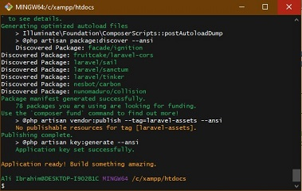
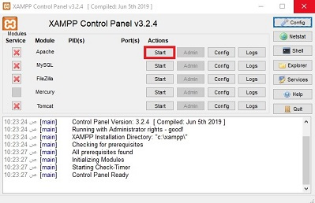
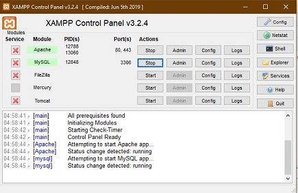
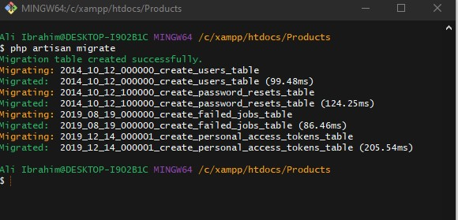
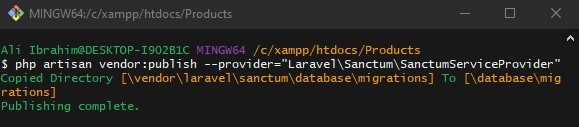

# Session 6: Server-side programming part 2 (Laravel  API development basics)

**Table of content**
- [Session 6: Server-side programming part 2 (Laravel  API development basics)](#session-6-server-side-programming-part-2-laravel--api-development-basics)
  - [The basics](#the-basics)
    - [Configure your project](#configure-your-project)
  - [Models and Migrations](#models-and-migrations)
  - [Controllers](#controllers)
  - [Routes](#routes)

- Before we get start with Laravel let us create a new project
- Connect to internet and then go to C:\xampp\htdocs and open CMD or any command line tool git for example and write the following command:

```bat
Laravel new Products
```

- After installation process is finished, you may see an output like this:
  

\
&nbsp;

- Here is a brief breakdown of the directories in a common Laravel application:
  - **app/** : This is the source folder where our application code lives. All controllers, policies, and models are inside this folder.
  - **bootstrap/** : Holds the application’s startup script and a few class map files.
  - **config/** : Holds the app’s configuration files. These are usually not modified directly but instead, rely on the values set up in the .env (environment) file at the root of the app.
  - **database/** : Houses the database files including migrations, seeds and test factories.
  - **public/** : Publicly accessible folder holding compiled assets and of course an index.php file.
  - **resources/** : Contains front-end assets such as javascript files, language files, CSS/SASS files and all templates used in the application (called blade templates).
  - **routes/** : All routes in the application are inside here. There are a few different “scopes” of routes but the one we will be focusing on is the web.php file.
  - **storage/** : All temporary cache files used by the application, session files, compiled view scripts and log files.
  - **tests/** : Contains test files for the application such as unit tests and functional tests.
  - **vendor/** : All dependency packages installed with composer
\
&nbsp;
- Now we can start learning Laravel ^_^.

## The basics

### Configure your project

- Open `.env` file and navigate to these lines:
  
\
&nbsp;
- These are the environment variable for your laravel application.
  - `DB_CONNECTION` tell Laravel what kind of database machine you use.
  - `DB_HOST` is the address of the database, because your database is in your local machine, so it will always 127.0.0.1 which mean is localhost.
  - `DB_PORT`  DB_PORT is your database port, by default, mysql will always use 3306 as it default port.
  - `DB_DATABASE` is the name of your database.
  - `DB_USERNAME` is a username that you used to log in to your database while `DB_PASSWORD` is your username password.
- Now, change the `DB_DATABASE` from its default to for example `products`.
- Open Xampp control panel.

    
\
&nbsp;
- Start the Apache and Mysql services.
    
\
&nbsp;
- Go to this link http://localhost/phpmyadmin/
- On the left side of the page you will see the databases in your local host, so click on the new button:
  
    
\
&nbsp;
- A new page will open to create a new database just put `products` in your database name and hit create button like this:
    
\
&nbsp;
- Now, in your terminal inside your project write this command:

```shell
php artisan migrate
```

**_we will explain this command later_**

- The output will look like this:
 .

- Finally, write this command:
```shell
php artisan vendor:publish --provider="Laravel\Sanctum\SanctumServiceProvider"
```



## Models and Migrations

## Controllers

## Routes
