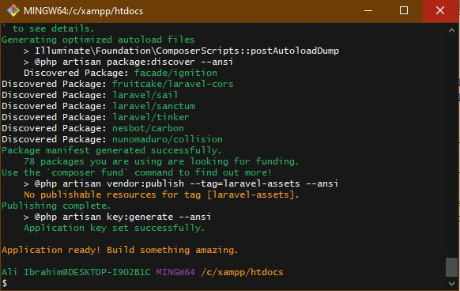
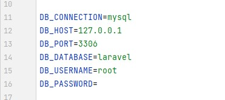
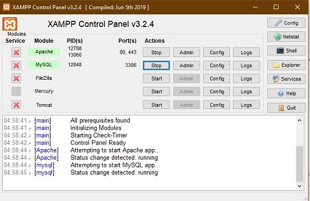
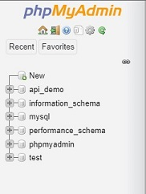
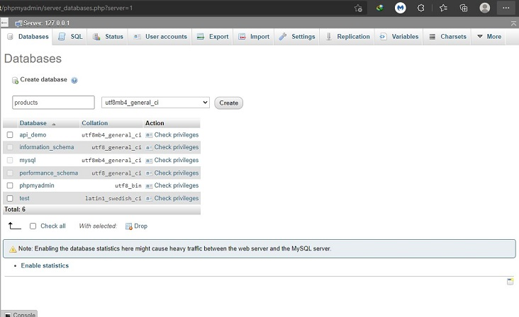
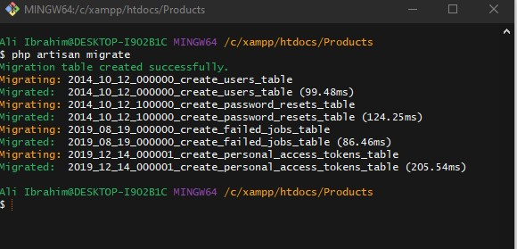

# Session : Server-side programming part 2 (Laravel  API development basics)

## Table of content

- [Session : Server-side programming part 2 (Laravel  API development basics)](#session--server-side-programming-part-2-laravel--api-development-basics)
  - [Table of content](#table-of-content)
  - [The basics](#the-basics)
    - [Configure your project](#configure-your-project)
  - [Models and Migrations](#models-and-migrations)
    - [Migrations](#migrations)
      - [Migration Structure](#migration-structure)
      - [Creating Tables](#creating-tables)
      - [Updating Tables](#updating-tables)
      - [Creating Columns](#creating-columns)
    - [Models](#models)
      - [Retrieving Models](#retrieving-models)
    - [Eloquent: API Resources](#eloquent-api-resources)
      - [Generating Resources](#generating-resources)
  - [Controllers](#controllers)
  - [Routes](#routes)
  - [Building API for Product application](#building-api-for-product-application)

- Before we get start with Laravel let us create a new project
- Connect to internet and then go to C:\xampp\htdocs and open CMD or any command line tool git for example and write the following command:

```shell
Laravel new Products
```

- After installation process is finished, you may see an output like this:
  


- Here is a brief breakdown of the directories in a common Laravel application:
  - **app/** : This is the source folder where our application code lives. All controllers, policies, and models are inside this folder.
  - **bootstrap/** : Holds the application’s startup script and a few class map files.
  - **config/** : Holds the app’s configuration files. These are usually not modified directly but instead, rely on the values set up in the .env (environment) file at the root of the app.
  - **database/** : Houses the database files including migrations, seeds and test factories.
  - **public/** : Publicly accessible folder holding compiled assets and of course an index.php file.
  - **resources/** : Contains front-end assets such as javascript files, language files, CSS/SASS files and all templates used in the application (called blade templates).
  - **routes/** : All routes in the application are inside here. There are a few different “scopes” of routes but the one we will be focusing on is the web.php file.
  - **storage/** : All temporary cache files used by the application, session files, compiled view scripts and log files.
  - **tests/** : Contains test files for the application such as unit tests and functional tests.
  - **vendor/** : All dependency packages installed with composer

- Now we can start learning Laravel ^_^.

## The basics

### Configure your project

- Open `.env` file and navigate to these lines:
  
\
&nbsp;
- These are the environment variable for your laravel application.
  - `DB_CONNECTION` tell Laravel what kind of database machine you use.
  - `DB_HOST` is the address of the database, because your database is in your local machine, so it will always 127.0.0.1 which mean is localhost.
  - `DB_PORT`  DB_PORT is your database port, by default, mysql will always use 3306 as it default port.
  - `DB_DATABASE` is the name of your database.
  - `DB_USERNAME` is a username that you used to log in to your database while `DB_PASSWORD` is your username password.
- Now, change the `DB_DATABASE` from its default to for example `products`.
- Open Xampp control panel.

    
\
&nbsp;
- Start the Apache and Mysql services.
    
\
&nbsp;
- Go to this link <http://localhost/phpmyadmin/>
- On the left side of the page you will see the databases in your local host, so click on the new button:
  
    
\
&nbsp;
- A new page will open to create a new database just put `products` in your database name and hit create button like this:
    
\
&nbsp;
- Now, in your terminal inside your project write this command:

```shell
php artisan migrate
```

**_we will explain this command later_**

- The output will look like this:
 .

- Finally, write this command:

```shell
php artisan vendor:publish --provider="Laravel\Sanctum\SanctumServiceProvider"
```


## Models and Migrations

- Almost every modern web application interacts with a database. Laravel makes interacting with databases extremely simple across a variety of supported databases using raw SQL, a fluent query builder, and the Eloquent ORM. Currently, Laravel provides first-party support for four databases:
  - MySQL 5.7+ (Version Policy)
  - PostgreSQL 9.6+ (Version Policy)
  - SQLite 3.8.8+
  - SQL Server 2017+ (Version Policy)
  More about Laravel database [here](https://laravel.com/docs/8.x/database).

We will now introduce you into migration and Models.

### Migrations

- Migrations are like version control for your database, allowing your team to define and share the application's database schema definition. If you have ever had to tell a teammate to manually add a column to their local database schema after pulling in your changes from source control, you've faced the problem that database migrations solve.
- The Laravel Schema `facade` provides database agnostic support for creating and manipulating tables across all of Laravel supported database systems. Typically, migrations will use this facade to create and modify database tables and columns.

- In order to generate a migration You may use the **`make:migration`** Artisan command to generate a database migration.
- The new migration will be placed in your **database/migrations** directory.
- Each migration filename contains a timestamp that allows Laravel to determine the order of the migrations:

```shell
php artisan make:migration create_flight_table
```

- Laravel will use the name of the migration to attempt to guess the name of the table and whether the migration will be creating a new table.
- If Laravel is able to determine the table name from the migration name, Laravel will pre-fill the generated migration file with the specified table. Otherwise, you may simply specify the table in the migration file manually.
- If you would like to specify a custom path for the generated migration, you may use the **_--path_** option when executing the **_make:migration_** command. The given path should be relative to your application's base path.

#### Migration Structure

- A migration class contains two methods: up and down.
- The up method is used to add new tables, columns, or indexes to your database, while the down method should reverse the operations performed by the up method.
- Within both of these methods, you may use the Laravel schema builder to expressively create and modify tables. To learn about all the methods available on the Schema builder, check out its documentation. For example, the following migration creates a flights table:

```php
<?php

use Illuminate\Database\Migrations\Migration;
use Illuminate\Database\Schema\Blueprint;
use Illuminate\Support\Facades\Schema;

class CreateFlightsTable extends Migration
{
    /**
     * Run the migrations.
     *
     * @return void
     */
    public function up()
    {
        Schema::create('flights', function (Blueprint $table) {
            $table->id();
            $table->string('name');
            $table->string('airline');
            $table->timestamps();
        });
    }

    /**
     * Reverse the migrations.
     *
     * @return void
     */
    public function down()
    {
        Schema::drop('flights');
    }
}
```

- To run all of your outstanding migrations, execute the **_migrate_** Artisan command:

```shell
php artisan migrate
```

- If you would like to see which migrations have run thus far, you may use the **_migrate:status_** Artisan command

```shell
php artisan migrate:status
```

- To roll back the latest migration operation, you may use the rollback Artisan command. This command rolls back the last "batch" of migrations, which may include multiple migration files:

```shell
php artisan migrate:rollback
```

#### Creating Tables

- To create a new database table, use the _create_ method on the Schema facade.
- The create method accepts two arguments: the first is the name of the table, while the second is a closure which receives a Blueprint object that may be used to define the new table:

```php
use Illuminate\Database\Schema\Blueprint;
use Illuminate\Support\Facades\Schema;

Schema::create('users', function (Blueprint $table) {
    $table->id();
    $table->string('name');
    $table->string('email');
    $table->timestamps();
});
```

#### Updating Tables

- The table method on the Schema facade may be used to update existing tables. Like the create method, the table method accepts two arguments: the name of the table and a closure that receives a Blueprint instance you may use to add columns or indexes to the table:

```php
use Illuminate\Database\Schema\Blueprint;
use Illuminate\Support\Facades\Schema;

Schema::table('users', function (Blueprint $table) {
    $table->integer('votes');
});
```

#### Creating Columns

- The table method on the Schema facade may be used to update existing tables.
- Like the create method, the table method accepts two arguments: the name of the table and a closure that receives an _Illuminate\Database\Schema\Blueprint_ instance you may use to add columns to the table:

```php
use Illuminate\Database\Schema\Blueprint;
use Illuminate\Support\Facades\Schema;

Schema::table('users', function (Blueprint $table) {
    $table->integer('votes');
});
```

- The **_bigIncrements_** method creates an auto-incrementing UNSIGNED BIGINT (primary key) equivalent column.
- The **_bigInteger_** method creates a BIGINT equivalent column.
- You can see the available column types [here](https://laravel.com/docs/8.x/migrations#available-column-types).

### Models

- Laravel includes Eloquent, an object-relational mapper (ORM) that makes it enjoyable to interact with your database.
- When using Eloquent, each database table has a corresponding "Model" that is used to interact with that table. In addition to retrieving records from the database table, Eloquent models allow you to insert, update, and delete records from the table as well

- To get started, let's create an Eloquent model.
- Models typically live in the app\Models directory and extend the _Illuminate\Database\Eloquent\Model_ class. You may use the **_make:model_** Artisan command to generate a new model:

```shell
php artisan make:model Flight
```

- If you would like to generate a database migration when you generate the model, you may use the --migration or -m option:

```shell
php artisan make:model Flight --migration
```

- You may generate various other types of classes when generating a model, such as factories, seeders, policies, and controllers. In addition, these options may be combined to create multiple classes at once:

```shell
# Generate a model and a FlightFactory class...
php artisan make:model Flight --factory
php artisan make:model Flight -f

# Generate a model and a FlightSeeder class...
php artisan make:model Flight --seed
php artisan make:model Flight -s

# Generate a model and a FlightController class...
php artisan make:model Flight --controller
php artisan make:model Flight -c

# Generate a model and a FlightPolicy class...
php artisan make:model Flight --policy

# Generate a model and a migration, factory, seeder, and controller...
php artisan make:model Flight -mfsc

# Shortcut to generate a model, migration, factory, seeder, policy, and controller...
php artisan make:model Flight --all

# Generate a pivot model...
php artisan make:model Member --pivot
```

- Models generated by the make:model command will be placed in the app/Models directory. Let's examine a basic model class and discuss some of Eloquent's key conventions:

```php
<?php

namespace App\Models;

use Illuminate\Database\Eloquent\Model;

class Flight extends Model
{
    //
}
```

- You can read about [Table Names](https://laravel.com/docs/8.x/eloquent#table-names) , [Primary Keys](https://laravel.com/docs/8.x/eloquent#primary-keys) , [default attribute values](https://laravel.com/docs/8.x/eloquent#default-attribute-values) ...etc

#### Retrieving Models

- Once you have created a model and its associated database table, you are ready to start retrieving data from your database. You can think of each Eloquent model as a powerful query builder allowing you to fluently query the database table associated with the model. The model's all method will retrieve all the records from the model's associated database table:

```php
use App\Models\Flight;

foreach (Flight::all() as $flight) {
    echo $flight->name;
}
```

- The Eloquent all method will return all the results in the model's table. However, since each Eloquent model serves as a query builder, you may add additional constraints to queries and then invoke the get method to retrieve the results:

```php
$flights = Flight::where('active', 1)
               ->orderBy('name')
               ->take(10)
               ->get();
```

- If you already have an instance of an Eloquent model that was retrieved from the database, you can "refresh" the model using the fresh and refresh methods. The fresh method will re-retrieve the model from the database. The existing model instance will not be affected:

```php
$flight = Flight::where('number', 'FR 900')->first();

$freshFlight = $flight->fresh();
```

- The refresh method will re-hydrate the existing model using fresh data from the database. In addition, all of its loaded relationships will be refreshed as well:

```php
$flight = Flight::where('number', 'FR 900')->first();

$flight->number = 'FR 456';

$flight->refresh();

$flight->number; // "FR 900"
```

- You may use the create method to "save" a new model using a single PHP statement. The inserted model instance will be returned to you by the method:

```php
use App\Models\Flight;

$flight = Flight::create([
    'name' => 'London to Paris',
]);
```

- However, before using the create method, you will need to specify either a fillable or guarded property on your model class. These properties are required because all Eloquent models are protected against mass assignment vulnerabilities by default.

- A mass assignment vulnerability occurs when a user passes an unexpected HTTP request field and that field changes a column in your database that you did not expect. For example, a malicious user might send an is_admin parameter through an HTTP request, which is then passed to your model's create method, allowing the user to escalate themselves to an administrator.

- So, to get started, you should define which model attributes you want to make mass assignable. You may do this using the $fillable property on the model. For example, let's make the name attribute of our Flight model mass assignable:

```php
<?php

namespace App\Models;

use Illuminate\Database\Eloquent\Model;

class Flight extends Model
{
    /**
     * The attributes that are mass assignable.
     *
     * @var array
     */
    protected $fillable = ['name'];
}
```

### Eloquent: API Resources

- When building an API, you may need a transformation layer that sits between your Eloquent models and the JSON responses that are actually returned to your application's users.
- For example, you may wish to display certain attributes for a subset of users and not others, or you may wish to always include certain relationships in the JSON representation of your models.
- Eloquent's resource classes allow you to expressively and easily transform your models and model collections into JSON.
- Of course, you may always convert Eloquent models or collections to JSON using their toJson methods; however, Eloquent resources provide more granular and robust control over the JSON serialization of your models and their relationships.

#### Generating Resources

- To generate a resource class, you may use the **_make:resource_** Artisan command.
- By default, resources will be placed in the _app/Http/Resources_ directory of your application
- Resources extend the _Illuminate\Http\Resources\Json\JsonResource_ class:
  
```shell
php artisan make:resource UserResource
```

- In addition to generating resources that transform individual models, you may generate resources that are responsible for transforming collections of models.
- This allows your JSON responses to include links and other meta information that is relevant to an entire collection of a given resource.
- To create a resource collection, you should use the **_--collection_** flag when creating the resource.
- Or, including the word _Collection_ in the resource name will indicate to Laravel that it should create a collection resource.
- Collection resources extend the _Illuminate\Http\Resources\Json\ResourceCollection_ class:

```shell
php artisan make:resource User --collection
```

or

```shell
php artisan make:resource UserCollection
```

- A resource class represents a single model that needs to be transformed into a JSON structure. For example, here is a simple UserResource resource class:
  
```php
<?php

namespace App\Http\Resources;

use Illuminate\Http\Resources\Json\JsonResource;

class UserResource extends JsonResource
{
    /**
     * Transform the resource into an array.
     *
     * @param  \Illuminate\Http\Request  $request
     * @return array
     */
    public function toArray($request)
    {
        return [
            'id' => $this->id,
            'name' => $this->name,
            'email' => $this->email,
            'created_at' => $this->created_at,
            'updated_at' => $this->updated_at,
        ];
    }
}
```

- Every resource class defines a toArray method which returns the array of attributes that should be converted to JSON when the resource is returned as a response from a route or controller method.
- Note that we can access model properties directly from the _$this_ variable.This is because a resource class will automatically proxy property and method access down to the underlying model for convenient access.

## Controllers

## Routes

## Building API for Product application
